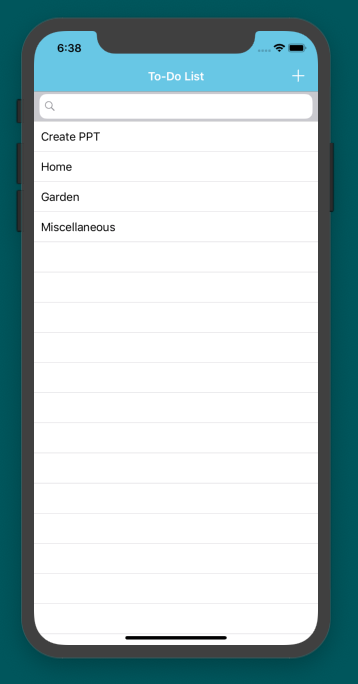

# To-DoList

To-Do List project where a user can create, update, delete and also search for a task. User can add a note with a task.This project has been implemented using Swift and CoreData.

YouTube Link for Demo:https://youtu.be/JAssglfJuVs  

  
